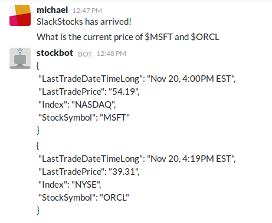

# Slack StockBot

Displays stock prices when queried with a ticker symbol.

Stocks must be prefaced with a $. For example, to query Microsoft, type `$MSFT`.

StockBot monitors all channels which it is participating. StockBot will also pick up on ticker symbols within sentences. Currently, StockBot does not work for private messages.

Please note, that as this bot uses Google Finance for ticker data, the responses returned are dependent on your IP. For instance, if querying Royal Bank of Canada, `$RY`, from a Canadian IP, Google Finance will return the TSE listed stock information.

Finally, TSE data is 15 minute delayed, whereas, NYSE & NASDAQ are realtime.

### Screenshots

### Requirements

Developed using python 3.4.3.

Currently using [hongtaocai's googlefinance](https://github.com/hongtaocai/googlefinance) library to provide realtime stock quotes.

To install dependencies `pip install -r requirements.txt`.

To run the bot replace the token in `run.py` and then run using `python run.py`.

### Future Improvement

Pretty format the StockBot response and include percentage change.

Setup unit test mocking for future development.

Include Heroku deployment steps and config files.

### License

MIT license

See LICENSE in the git repo for further details.
